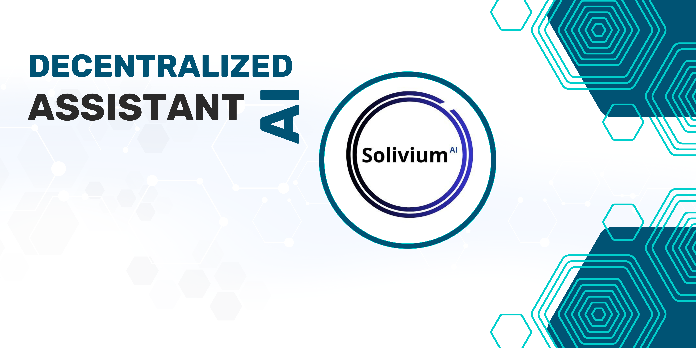

# Solivium: Decentralized Personal Assistant

<div align="center">



[](LICENSE)
[](https://solana.com)
[](CONTRIBUTING.md)

*Your AI-powered assistant, seamlessly integrated with the Solana blockchain.*

[Getting Started](docs/getting-started.md) • 
[Documentation](#documentation) • 
[Contributing](CONTRIBUTING.md) • 
[License](#license)

</div>

---

## **Overview**

Solivium is a decentralized personal assistant designed to empower users in the Solana ecosystem. With cutting-edge AI capabilities, Solivium offers real-time wallet insights, personalized notifications, and blockchain analytics—all within a fast, decentralized, and secure framework.

Key features include:
- **Wallet tracking**: Monitor and analyze wallet activities.
- **AI-powered recommendations**: Optimize investments and transactions.
- **Real-time alerts**: Stay informed about market movements and wallet changes.

---

## **Features**

### **Blockchain Integrated 🛠️**
Solivium connects directly to the Solana blockchain, providing real-time insights into wallet balances, transaction history, and smart contract interactions.

---

### **AI-Driven Intelligence 🧠**
Leverage machine learning and AI to:
- Analyze spending patterns.
- Recommend staking or yield-farming opportunities.
- Predict trends in decentralized finance (DeFi).

---

### **Secure & Decentralized 🔒**
Your data remains yours. Solivium operates securely within the decentralized Solana network, ensuring privacy and transparency.

---

### **User-Friendly Interface 📱**
An intuitive, web-based dashboard allows you to:
- View wallet performance.
- Receive tailored AI recommendations.
- Manage multiple wallets with ease.

---

## **Quick Start**

### Prerequisites
- Solana CLI installed
- Node.js and Python 3.8+
- Basic understanding of blockchain and AI

### Installation

1. Clone the repository:
    ```bash
    git clone https://github.com/your-username/Solivium.git
    cd Solivium
    ```

2. Set up the backend:
    ```bash
    cd backend
    python -m venv venv
    source venv/bin/activate
    pip install -r requirements.txt
    uvicorn main:app --reload
    ```

3. Set up the frontend:
    ```bash
    cd client
    npm install
    npm start
    ```

4. Deploy smart contracts:
    ```bash
    cd contracts
    anchor build
    anchor deploy
    ```

For more details, see our [Getting Started Guide](docs/getting-started.md).

---

## **Documentation**

Comprehensive guides and references:
- [Getting Started Guide](docs/getting-started.md): Initial setup and usage.
- [Smart Contract API](docs/contracts.md): Solana program interactions.
- [AI Logic](docs/ai.md): Overview of AI-powered features.
- [Dashboard Walkthrough](docs/dashboard.md): User interface guide.

---

## **Technical Specifications**

- **Blockchain**: Solana
- **Languages**: Rust (Smart Contracts), Python (Backend), JavaScript (Frontend)
- **AI Framework**: FastAPI, NumPy, and other ML libraries
- **Frontend**: React with API integrations

---

## **Contributing**

We welcome contributions! To contribute:
- Read the [Contributing Guide](CONTRIBUTING.md).
- Follow our coding standards.
- Submit pull requests for review.

---

## **License**

This project is licensed under the MIT License.
